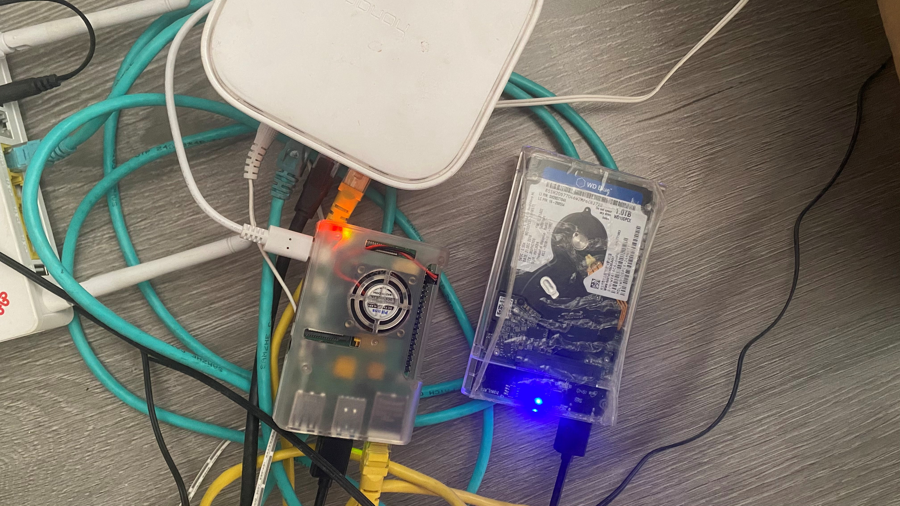
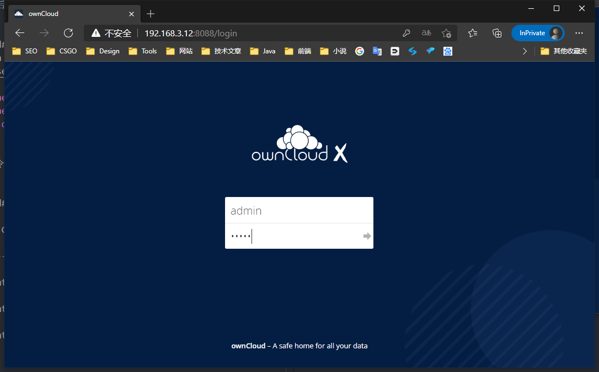
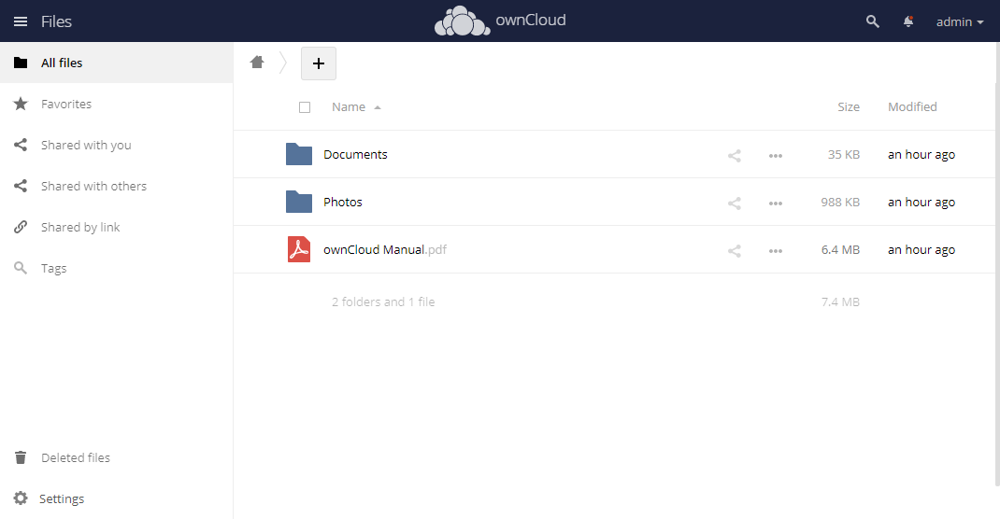
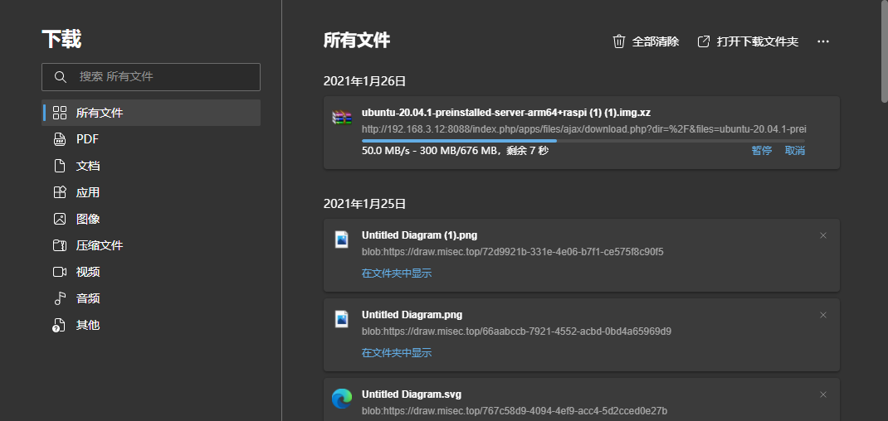
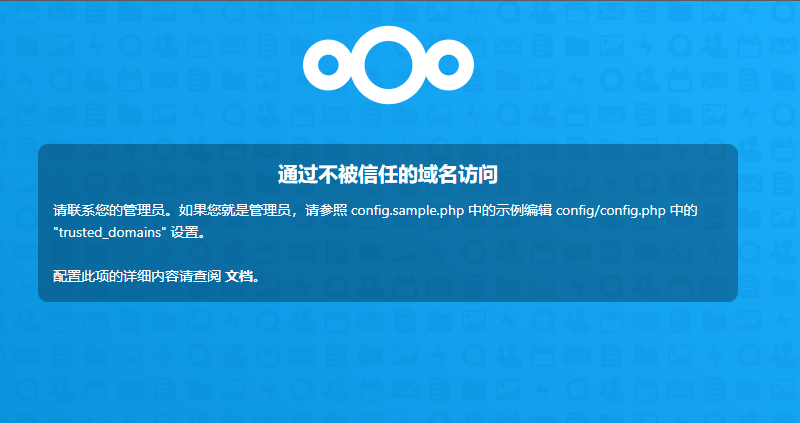
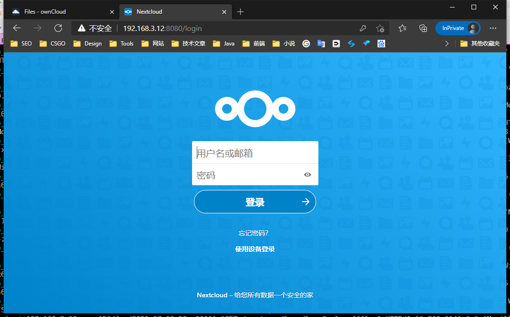
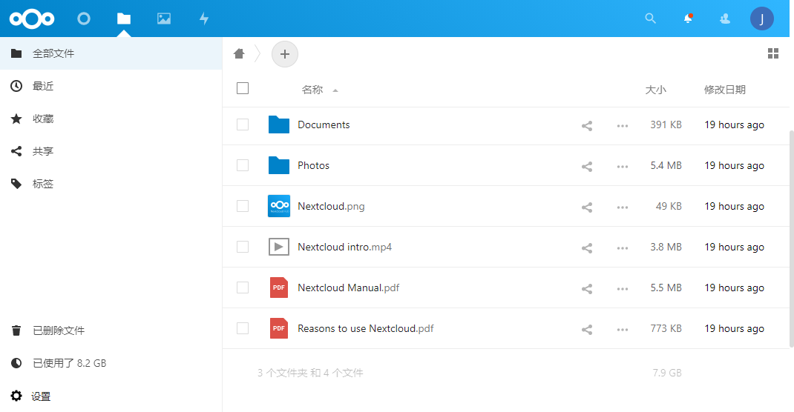
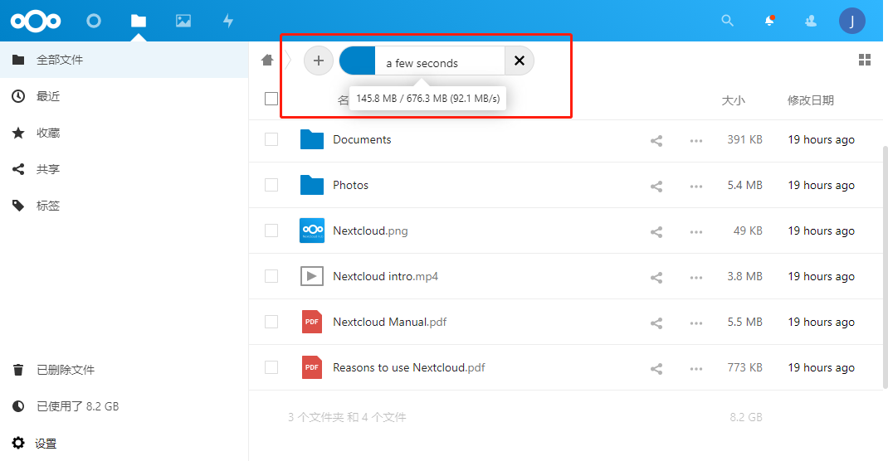
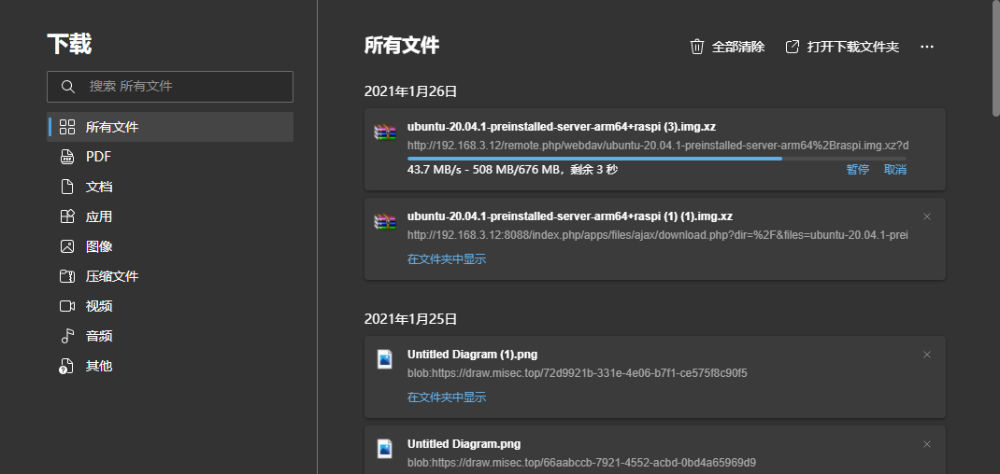

## 前言
继上次开箱树莓派4B也过了将近个把月了，期间也尝试过在树莓派上跑了一些服务，总体来讲8G版本的内存确实过剩，除了有次构建aarch64架构的docker镜像时内存占用一度上了40%之外，其余时间基本都在20%左右。今天就来讲讲如何使用树莓派打造私有网盘。上传下载50MB/S是问题不大滴,并且介绍的这两款开源网盘都有跨平台的客户端,支持流媒体播放,基本算是一个丐版NAS.
<!-- more -->

## 情况介绍
我的树莓派是直接通过网线连在千兆的路由器上，我房间的网线也都是六类线，勉强算是千兆内网了。由于我之前使用的64G的金士顿TF卡插在树莓派上运行，内存卡做网盘的话，多少是有点局限性的，就不提读写瓶颈了，容量也是大个问题。（这个问题可以额外挂载一块硬盘），而我选择了直接通过USB3.0从1T的机械盘中启动系统，彻底抛开了TF卡。


在我房间基本就像这样,和路由器一起,emmmm 算是个文件服务器,也算是个aarch64的小型服务器.未来可能也算个家庭环境传感器的数据处理中心?(刘同学又在强行蹭高级词汇了 orz)

树莓派4B是支持原生USB启动的，但是要求bootloader版本比较新，可能需要卡刷下`EEPROM`。这部分我就不额外展开讲了，有兴趣的同学可以看看我上期的文章。（糟糕，忘了我还没写这篇文章）.

系统我采用了Ubuntu Server 20.10,之所所以选择20.10不选择20.04的原因是20.04的系统无法直接USB引导启动，需要额外的做一些配置（配置后会导致硬盘读写性能锐减，这里我没找到原因，通过TF卡引导USB接口上的硬盘启动20.04则没有这个问题），而20.10版本则可以直接启动。当然如果你使用TF卡跑在Ubuntu20.04上，按照本教程走也没有任何问题。

为什么选择Ubuntu，因为树莓派是Ubuntu的认证设备，可靠性是很强滴。
>[Ubuntu 20.04 LTS is certified for the Raspberry Pi](https://ubuntu.com/blog/ubuntu-20-04-lts-is-certified-for-the-raspberry-pi)
>
>[Raspberry Pi and Ubuntu: 2020 roundup](https://ubuntu.com/blog/raspberry-pi-and-ubuntu-2020-roundup)

关于网盘的选择，这里我选择了ownCloud和nextCloud，方式是使用Docker容器部署，因为部署方便，隔离性也比较好。

接下来废话就不多说了，直接开始搞起,基本全程命令配置，跟着教程走不易出错。

## 前期准备

### 使用清华大学的源

由于Ubuntu自己的源国内访问多少有那么些慢，所以这里我们采用tuna的源,请根据自己的系统版本选择对应的源。

```bash
# 先备份更新源文件
sudo cp -p /etc/apt/sources.list /etc/apt/sources.list.bak
# 修改apt源文件,将Ubuntu自己的源用 # 注释。
sudo vim /etc/apt/sources.list
```

**Ubuntu20.04.1 LTS**

```
# 默认注释了源码镜像以提高 apt update 速度，如有需要可自行取消注释
deb https://mirrors.tuna.tsinghua.edu.cn/ubuntu-ports/ focal main restricted universe multiverse
# deb-src https://mirrors.tuna.tsinghua.edu.cn/ubuntu-ports/ focal main restricted universe multiverse
deb https://mirrors.tuna.tsinghua.edu.cn/ubuntu-ports/ focal-updates main restricted universe multiverse
# deb-src https://mirrors.tuna.tsinghua.edu.cn/ubuntu-ports/ focal-updates main restricted universe multiverse
deb https://mirrors.tuna.tsinghua.edu.cn/ubuntu-ports/ focal-backports main restricted universe multiverse
# deb-src https://mirrors.tuna.tsinghua.edu.cn/ubuntu-ports/ focal-backports main restricted universe multiverse
deb https://mirrors.tuna.tsinghua.edu.cn/ubuntu-ports/ focal-security main restricted universe multiverse
# deb-src https://mirrors.tuna.tsinghua.edu.cn/ubuntu-ports/ focal-security main restricted universe multiverse

# 预发布软件源，不建议启用
# deb https://mirrors.tuna.tsinghua.edu.cn/ubuntu-ports/ focal-proposed main restricted universe multiverse
# deb-src https://mirrors.tuna.tsinghua.edu.cn/ubuntu-ports/ focal-proposed main restricted universe multiverse
```
**Ubuntu20.10**


```
# 默认注释了源码镜像以提高 apt update 速度，如有需要可自行取消注释
deb https://mirrors.tuna.tsinghua.edu.cn/ubuntu-ports/ groovy main restricted universe multiverse
# deb-src https://mirrors.tuna.tsinghua.edu.cn/ubuntu-ports/ groovy main restricted universe multiverse
deb https://mirrors.tuna.tsinghua.edu.cn/ubuntu-ports/ groovy-updates main restricted universe multiverse
# deb-src https://mirrors.tuna.tsinghua.edu.cn/ubuntu-ports/ groovy-updates main restricted universe multiverse
deb https://mirrors.tuna.tsinghua.edu.cn/ubuntu-ports/ groovy-backports main restricted universe multiverse
# deb-src https://mirrors.tuna.tsinghua.edu.cn/ubuntu-ports/ groovy-backports main restricted universe multiverse
deb https://mirrors.tuna.tsinghua.edu.cn/ubuntu-ports/ groovy-security main restricted universe multiverse
# deb-src https://mirrors.tuna.tsinghua.edu.cn/ubuntu-ports/ groovy-security main restricted universe multiverse

# 预发布软件源，不建议启用
# deb https://mirrors.tuna.tsinghua.edu.cn/ubuntu-ports/ groovy-proposed main restricted universe multiverse
# deb-src https://mirrors.tuna.tsinghua.edu.cn/ubuntu-ports/ groovy-proposed main restricted universe multiverse
```

完成后执行以下命令更新下软解列表和软件。
```
sudo apt update
sudo apt upgrade
```

### 安装依赖和`Docker`

1. 安装一些依赖和`docker-compose`，如果是20.10的系统，可能需要自己构建，这个过程中耐心等待即可。

```
sudo apt-get update && sudo apt-get install -y vim python3-pip curl git
pip3 install --upgrade pip
pip install docker-compose
```

2. 安装`Docker`,其中`Docker`的安装可能较慢，需要耐心等。

```bash
# 国内用户一键安装Docker，这个会快一些
sudo curl -sSL https://get.daocloud.io/docker | sh 

# 使用docker的安装脚本安装
sudo curl -sSL get.docker.com | sh
```

3. 使用`docker -v`和`docker-compose -v`命令验证是否安装成功,如果出现类似的信息，则安装成功。

```bash
root@Raspberry-Pi4:/# docker -v
Docker version 20.10.2, build 2291f61

root@Raspberry-Pi4:/# docker-compose -v
docker-compose version 1.28.0, build unknown

```

4. 到目前为止我们的前置工具基本上已经安装到位了。在开始网盘的安装之前，我们为`Docker`配置个加速源，因为国内的网络问题，拉镜像可能会经常失败,依次执行如下命令即可。

```bash
sudo mkdir -p /etc/docker

sudo tee /etc/docker/daemon.json <<-'EOF'
{
  "registry-mirrors": ["http://hub-mirror.c.163.com"]
}
EOF

sudo systemctl daemon-reload
sudo systemctl restart docker
```

再给大家额外提供几个镜像地址,需要的时候直接替换[]内的地址即可。

```
Docker中国区官方镜像
https://registry.docker-cn.com

中国科技大学
https://docker.mirrors.ustc.edu.cn

阿里云的镜像加速器需要申请自己的地址
https://cr.console.aliyun.com/

申请到的专属地址大概长这样：https://xxxxxx.mirror.aliyuncs.com
```

## 安装own cloud

1. 在`/home/`下创建个`ownCloud`文件夹，并且进入到这个目录。
```
sudo mkdir /home/ownCloud
cd /home/ownCloud
```
2. 创建云盘的配置文件，初始化的时候会将此配置文件作为云盘初始化的参数传递，用户名默和密码默认是admin,默认工作在8080端口，这个可以根据自己的需求自定义。

```bash
cat << EOF > .env
OWNCLOUD_VERSION=10.6
OWNCLOUD_DOMAIN=localhost:8088
ADMIN_USERNAME=admin
ADMIN_PASSWORD=admin
HTTP_PORT=8088
EOF
```
3. 创建docker-compose.yml文件,数据库的相关密码和信息都写在了此文件中，参见owncloud的environment参数列表。不建议小白随意改动此文件。

```yml
version: '2.1'

volumes:
  files:
    driver: local
  mysql:
    driver: local
  backup:
    driver: local
  redis:
    driver: local

services:
  owncloud:
    image: owncloud/server:${OWNCLOUD_VERSION}
    restart: always
    ports:
      - ${HTTP_PORT}:8080
    depends_on:
      - db
      - redis
    environment:
      - OWNCLOUD_DOMAIN=${OWNCLOUD_DOMAIN}
      - OWNCLOUD_DB_TYPE=mysql
      - OWNCLOUD_DB_NAME=owncloud
      - OWNCLOUD_DB_USERNAME=owncloud
      - OWNCLOUD_DB_PASSWORD=owncloud
      - OWNCLOUD_DB_HOST=db
      - OWNCLOUD_ADMIN_USERNAME=${ADMIN_USERNAME}
      - OWNCLOUD_ADMIN_PASSWORD=${ADMIN_PASSWORD}
      - OWNCLOUD_MYSQL_UTF8MB4=true
      - OWNCLOUD_REDIS_ENABLED=true
      - OWNCLOUD_REDIS_HOST=redis
    healthcheck:
      test: ["CMD", "/usr/bin/healthcheck"]
      interval: 30s
      timeout: 10s
      retries: 5
    volumes:
      - files:/mnt/data

  db:
    image: webhippie/mariadb:latest
    restart: always
    environment:
      - MARIADB_ROOT_PASSWORD=owncloud
      - MARIADB_USERNAME=owncloud
      - MARIADB_PASSWORD=owncloud
      - MARIADB_DATABASE=owncloud
      - MARIADB_MAX_ALLOWED_PACKET=128M
      - MARIADB_INNODB_LOG_FILE_SIZE=64M
    healthcheck:
      test: ["CMD", "/usr/bin/healthcheck"]
      interval: 30s
      timeout: 10s
      retries: 5
    volumes:
      - mysql:/var/lib/mysql
      - backup:/var/lib/backup

  redis:
    image: webhippie/redis:latest
    restart: always
    environment:
      - REDIS_DATABASES=1
    healthcheck:
      test: ["CMD", "/usr/bin/healthcheck"]
      interval: 30s
      timeout: 10s
      retries: 5
    volumes:
      - redis:/var/lib/redis
```

4. 使用`docker-compose up -d`命令启动网盘,第一次启动时需要拉取镜像,这个过程需要的时间取决于网络环境,当镜像拉取完成后,你看到如下输出时,意味着容器已经启动了.

```bash
root@Raspberry-Pi4:/home/ownCloud# docker-compose up -d
Building with native build. Learn about native build in Compose here: https://docs.docker.com/go/compose-native-build/

Starting owncloud_redis_1 ... done
Starting owncloud_db_1    ... done
Starting owncloud_owncloud_1 ... done
```
   
此时可以通过`docker-compose ps`命令查看容器的状态.

```bash
root@Raspberry-Pi4:/home/ownCloud# docker-compose ps

       Name                      Command                  State               Ports         
--------------------------------------------------------------------------------------------
owncloud_db_1         /usr/bin/entrypoint /bin/s ...   Up (healthy)   3306/tcp              
owncloud_owncloud_1   /usr/bin/entrypoint /usr/b ...   Up (healthy)   0.0.0.0:8088->8080/tcp
owncloud_redis_1      /usr/bin/entrypoint /bin/s ...   Up (healthy)   6379/tcp     

```

耐心等待数分钟,会自动完成相关的初始化工作,此时,可以访问 `http://树莓派ip:8088` 开始使用云盘.





5. 问题排查,如果访问8088端口没有登录页面,那可能由于以下原因导致的.

- 8088端口没有放行.执行`sudo ufw allow 8088`放行端口.
- 云盘初始化还没有完成.使用`docker-compose logs --follow owncloud`命令确诊初始化是否完成.如果有如下输入,则可以确定初始化已经完成了.

```bash
owncloud_1  | Writing apache config...
owncloud_1  | Enabling cron background...
owncloud_1  | Set mode for background jobs to 'cron'
owncloud_1  | Touching cron configs...
owncloud_1  | Starting cron daemon...
owncloud_1  | Starting apache daemon...
```


## Docker和docker-compose知识穿插混讲

看了如上的教程,可能你还不是很理解执行的一些命令是什么意思,这里我穿插讲一下一些`docker`和`docker-compose`命令.

### docker-compose的常用管理命令.

使用`docker-compose`命令前,我们要确认命令行已经进入了`docker-compose.yml`文件所在的目录,如果不在,那我们需要在命令中指定`docker-compose.yml`的位置路径.

例如`docker-compose -f /home/ownCloud/docker-compose.yml ps` .

- `docker-compose up -d` 启动容器并在后台运行
- `docker-compose stop` 停止已运行的容器
- `docker-compose restart` 重启容器
- `docker-compose ps` 列出容器
- `docker-compose logs`查看日志
- `docker-compose down`停止并且移除容器
- `docker-compose help`查看所有命令

以上这些命令可以在后面跟上容器名,指定要操作的容器.

例如`docker-compose stop owncloud_redis_1` 

## Docker命令

Docker命令我这里只讲一个查看数据卷的命令,因为你使用`down`命令移除销毁云盘容器之后,不意味着你之前的数据就没了,当你再次启动容器时,这些数据依旧会存在.

所以我们可以通过`docker volume ls`命令查看所有的数据卷.

```bash
root@Raspberry-Pi4:/# docker volume ls
DRIVER    VOLUME NAME
local     owncloud_backup
local     owncloud_files
local     owncloud_mysql
local     owncloud_redis
```

通过`docker volume rm 名称1 名称2 `来移除这些数据卷,不移除的话,下次up -d数据依旧会存在.

通过`docker volume inspect 数据卷名称`来查看他们的具体位置.
```bash
root@Raspberry-Pi4:/# docker volume inspect owncloud_files 
[
    {
        "CreatedAt": "2021-01-26T12:46:24+08:00",
        "Driver": "local",
        "Labels": {
            "com.docker.compose.project": "owncloud",
            "com.docker.compose.version": "1.28.0",
            "com.docker.compose.volume": "files"
        },
        "Mountpoint": "/var/lib/docker/volumes/owncloud_files/_data",
        "Name": "owncloud_files",
        "Options": null,
        "Scope": "local"
    }
]
```

## 安装nextCloud

nextCloud这里我只介绍postgre数据库版本的安装方式.

1. 在`/home/`下创建个`nextCloud`文件夹，并且进入到这个目录。
```
sudo mkdir /home/nextCloud
cd /home/nextCloud
```
2. 创建云盘配置文件,同样的这些文件会在初始化服务时用到,两个`nextcloud_admin_xxx.txt`文件对应的是你登陆的账号和密码.`postgres_db.txt`对应的是数据库名,以此类推.

```bash
echo admin > nextcloud_admin_user.txt
echo admin > nextcloud_admin_password.txt
echo nextcloud > postgres_db.txt
echo nextcloud > postgres_user.txt
echo nextcloud > postgres_password.txt
```
3. 创建`docker-compose.yml` ,默认启动端口为8080,如果需要指定端口只需要将app字段下的ports 修改为你想要设置的端口即可. 例如`- 9000:80`,注意,只需要修改左侧的端口号即可.

```
version: '3.2'

services:
  db:
    image: postgres
    restart: always
    volumes:
      - db:/var/lib/postgresql/data
    environment:
      - POSTGRES_DB_FILE=/run/secrets/postgres_db
      - POSTGRES_USER_FILE=/run/secrets/postgres_user
      - POSTGRES_PASSWORD_FILE=/run/secrets/postgres_password
    secrets:
      - postgres_db
      - postgres_password
      - postgres_user

  app:
    image: nextcloud
    restart: always
    ports:
      - 8080:80
    volumes:
      - nextcloud:/var/www/html
    environment:
      - POSTGRES_HOST=db
      - POSTGRES_DB_FILE=/run/secrets/postgres_db
      - POSTGRES_USER_FILE=/run/secrets/postgres_user
      - POSTGRES_PASSWORD_FILE=/run/secrets/postgres_password
      - NEXTCLOUD_ADMIN_PASSWORD_FILE=/run/secrets/nextcloud_admin_password
      - NEXTCLOUD_ADMIN_USER_FILE=/run/secrets/nextcloud_admin_user
    depends_on:
      - db
    secrets:
      - nextcloud_admin_password
      - nextcloud_admin_user
      - postgres_db
      - postgres_password
      - postgres_user

volumes:
  db:
  nextcloud:

secrets:
  nextcloud_admin_password:
    file: ./nextcloud_admin_password.txt # put admin password to this file
  nextcloud_admin_user:
    file: ./nextcloud_admin_user.txt # put admin username to this file
  postgres_db:
    file: ./postgres_db.txt # put postgresql db name to this file
  postgres_password:
    file: ./postgres_password.txt # put postgresql password to this file
  postgres_user:
    file: ./postgres_user.txt # put postgresql username to this file
```

4. 使用`docker-compose up -d`命令启动.

第一次启动时需要拉取镜像,这个过程需要的时间取决于网络环境,当镜像拉取完成后,你看到如下输出时,意味着容器已经启动了,耐心等待数分钟即可打开 `http://树莓派的ip:8080`开始登录使用网盘.
```bash
root@Raspberry-Pi4:/home/nextCloud# docker-compose up -d
Building with native build. Learn about native build in Compose here: https://docs.docker.com/go/compose-native-build/
Creating network "nextcloud_default" with the default driver
Creating nextcloud_db_1 ... done
Creating nextcloud_app_1 ... done
```

ps:容器启动状态为`done`的时候不意味着服务已经初始化完成,请使用`docker-compose logs --follow app` 查看日志,确保初始化已经完全完成.

5. 修改配置文件
第一次登陆时,你可能会遇到如下提示



此时回一下我们提到docker查看数据卷位置命令,对,就是`docker volume`命令,查看下数据卷位置.`docker volume inspect nextcloud_nextcloud`
```
root@Raspberry-Pi4:/home/nextCloud# docker volume inspect nextcloud_nextcloud 
[
    {
        "CreatedAt": "2021-01-25T20:35:29+08:00",
        "Driver": "local",
        "Labels": {
            "com.docker.compose.project": "nextcloud",
            "com.docker.compose.version": "1.28.0",
            "com.docker.compose.volume": "nextcloud"
        },
        "Mountpoint": "/var/lib/docker/volumes/nextcloud_nextcloud/_data",
        "Name": "nextcloud_nextcloud",
        "Options": null,
        "Scope": "local"
    }
]

```

然后我们cd到`/var/lib/docker/volumes/nextcloud_nextcloud/_data`目录,使用`nano config/config.php` 修改`trusted_domains`配置.

```php
'trusted_domains' => 
  array (
    0 => 'localhost',
    1 => '改为你树莓派的实际ip',
  ),
```

之后刷新,我们便可以登陆啦~~~




### nextCloud的调优

1. 优化上传速度
执行`docker exec -u 33 -it nextcloud_app_1 bash` 使用33用户进入容器.
执行`php occ config:app:set files max_chunk_size --value 0` 取消块大小限制
```bash
root@Raspberry-Pi4:/home/nextCloud# docker exec -u 33 -it nextcloud_app_1 bash
www-data@e0dd14717e86:~/html$ php occ config:app:set files max_chunk_size --value 0
Config value max_chunk_size for app files set to 0

```

2. 使用`nginx`代理,比如监听80,然后转到8080,不再赘述.

感受下上传和下载速度吧~~




## 参考列表

- [owncloud](https://doc.owncloud.org/server/10.6/admin_manual/installation/docker/) 
- [nextcloud/docker](https://github.com/nextcloud/docker)
- [docker/compose](https://docs.docker.com/compose/reference/overview/)
- [TUNA Ubuntu Ports](https://mirror.tuna.tsinghua.edu.cn/help/ubuntu-ports/)
- [Ubuntu 20.04 LTS is certified for the Raspberry Pi](https://ubuntu.com/blog/ubuntu-20-04-lts-is-certified-for-the-raspberry-pi)
- [Raspberry Pi and Ubuntu: 2020 roundup](https://ubuntu.com/blog/raspberry-pi-and-ubuntu-2020-roundup)